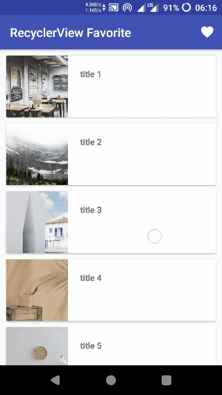
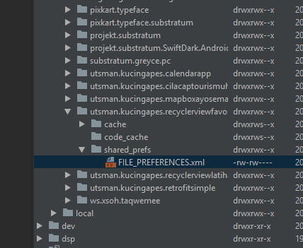
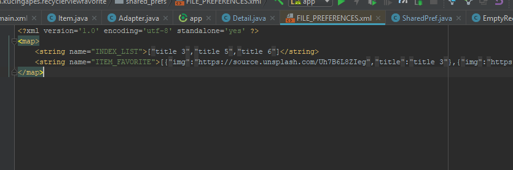

# Membuat Fitur Favorit pada RecyclerView



## Penjelasan Dikit
SharedPreferences gunanya untuk menyimpan informasi kecil-kecilan, tapi dalam beberapa kasus juga bisa dalam skala besar. Informasi itu akan di simpan dalam file xml yang berisi string pada folder data/data/packageaplikasi/shared_prefs, untuk kasus list, gampangnye dikonvert dulu ke json sebagai string terus diambil dan di konversi lagi sebagai list.



(di atas adalah gambar letak folder shared_prefs yang berisi file xml nya)



(nah ini nih isi dari file xml yang telah dibuat dengan sharedpreferences)


Dengan membuat class yang berisi SharedPreferences, kita bisa bikin RecyclerView yang bisa dibikin fitur favorit.

## Cara buatnya
Nih classnya sama sedikit penjelasan

```java
public class SharedPref {

    /* Deklarasi dulu nama file dan string yang akan di buat dalam folder sharedpreferences */
    /* Nama file nya */
    private static final String PREFS_NAME = "FILE_PREFERENCES";

    /* String item list utama */
    private static final String FAVORITES = "ITEM_FAVORITE";

    /* Single string untuk ambil posisi (index) */
    private static final String INDEX = "INDEX_LIST";

    /* Metode save list */
    private void saveFavorites(Context context, List<Item> favorites) {
        SharedPreferences settings;
        SharedPreferences.Editor editor;

        settings = context.getSharedPreferences(PREFS_NAME,
                MODE_PRIVATE);
        editor = settings.edit();

        Gson gson = new Gson();
        String jsonFavorites = gson.toJson(favorites); // konversi ke string json

        editor.putString(FAVORITES, jsonFavorites);
        editor.apply();
    }


    /* Metode menambah item ke list sharedpreferences*/
    public void addFavorite(Context context, Item Item) {
        List<Item> favorites = getFavorites(context);
        if (favorites == null)
            favorites = new ArrayList<>();

        favorites.add(Item); // menambahkan item ke list
        saveFavorites(context, favorites); // memanggil metode saveFavorites untuk di simpan dalam file
    }

    /* Metode untuk mengapus item di list */
    public void removeFavorite(Context context, int pos) {
        ArrayList<Item> favorites = getFavorites(context);
        if (favorites != null) {
            favorites.remove(pos); // menghapus item berdasarkan posisi index (int)
            saveFavorites(context, favorites);
        }
    }

    /* Metode untuk memanggil list untuk di display dalam recyclerview */
    public ArrayList<Item> getFavorites(Context context) {
        SharedPreferences settings;
        List<Item> favorites;

        settings = context.getSharedPreferences(PREFS_NAME,
                MODE_PRIVATE);

        if (settings.contains(FAVORITES)) {
            String jsonFavorites = settings.getString(FAVORITES, null);
            Gson gson = new Gson();

            /* mengambil arraylist dari file yang telah disimpan */
            Item[] favoriteItems = gson.fromJson(jsonFavorites,
                    Item[].class);
            favorites = Arrays.asList(favoriteItems);
            favorites = new ArrayList<>(favorites);
        } else
            return null;

        return (ArrayList<Item>) favorites;
    }


    /* Metode ntuk mengambil posisi item, dibuat single string pada list baru */
    public void addIndex(Context context, String string) {
        List<String> names;
        SharedPreferences preferences = context.getSharedPreferences(PREFS_NAME,
                MODE_PRIVATE);
        String json = preferences.getString(INDEX, null);
        Gson gson = new Gson();
        Type type = new TypeToken<List<String>>() {}.getType(); // mengatur tipe single string pada list
        names = gson.fromJson(json, type);
        if (names == null) {
            names = new ArrayList<>();
        }
        names.add(string); // menambahkan item string, harus dipanggil bersamaan dengan metode addFavorite
        SharedPreferences.Editor editor = preferences.edit();

        String listJson = gson.toJson(names);
        editor.putString(INDEX, listJson);
        editor.apply();
    }


    /* Metode untuk menghapus, sama sih kaya diatas, cuman ini buat remove string nya */
    public void removeIndex(Context context, String string) {
        List<String> names;
        SharedPreferences preferences = context.getSharedPreferences(PREFS_NAME,
                MODE_PRIVATE);
        String json = preferences.getString(INDEX, null);
        Gson gson = new Gson();
        Type type = new TypeToken<List<String>>() {}.getType();
        names = gson.fromJson(json, type);
        if (names == null) {
            names = new ArrayList<>();
        }
        names.remove(string); // nah ini ngapus single string
        SharedPreferences.Editor editor = preferences.edit();

        String listJson = gson.toJson(names);
        editor.putString(INDEX, listJson);
        editor.apply();
    }

    /* Metode untuk mengambil posisi di keberapa dia item nya */
    public int setIndex(Context context, String string) {
        List<String> names;
        SharedPreferences preferences = context.getSharedPreferences(PREFS_NAME,
                MODE_PRIVATE);
        String json = preferences.getString(INDEX, null);
        Gson gson = new Gson();
        Type type = new TypeToken<List<String>>() {}.getType();
        names = gson.fromJson(json, type);
        int position = 0;
        if (names != null) {
            position = names.indexOf(string);
        }
        return position; // return ke hasil
    }
}

```
link https://github.com/kucingapes/RecyclerViewFavorite/blob/master/app/src/main/java/utsman/kucingapes/recyclerviewfavorite/SharedPref.java

Nah kemudian panggil ke dalam activity detail dan acivity recyclerview

```java
Item item = new Item(img, title); // pasang objek yang mau ditambahin ke recyclerview
        
/* ngecek apakah itemnya udeh ada di favorit ape belum */
if (json != null && json.contains(title)) { // andaikata udah ada
    actionButton.setImageResource(R.drawable.ic_favorite_border);
    Toast.makeText(getApplicationContext(), "dihapus", Toast.LENGTH_SHORT).show();
    SharedPref sharedPref = new SharedPref();
    int position = sharedPref.setIndex(getApplicationContext(), title);
    sharedPref.removeFavorite(getApplicationContext(), position); // maka metodenya adalah remove item
    sharedPref.removeIndex(getApplicationContext(), title); // nah ini remove string single nya buat acuan posisi item

} else { // nah kalau belom
    actionButton.setImageResource(R.drawable.ic_favorite);
    SharedPref sharedPref = new SharedPref();
    sharedPref.addFavorite(getApplicationContext(), item); // ya tambahin deh
    sharedPref.addIndex(getApplicationContext(), title);

    Toast.makeText(getApplicationContext(), "ditambahkan", Toast.LENGTH_SHORT).show();
}

```
link https://github.com/kucingapes/RecyclerViewFavorite/blob/master/app/src/main/java/utsman/kucingapes/recyclerviewfavorite/Detail.java

Dah ah sekian silahkan dicoba.


